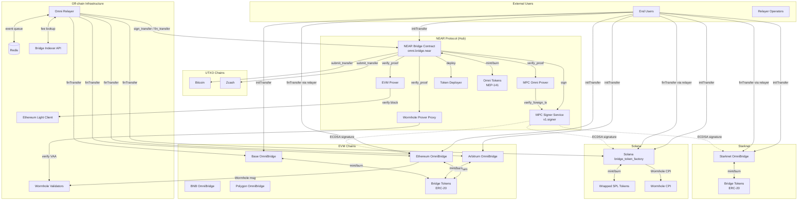

# Omni Bridge — Threat Model Report

## Architectural Diagram

---

## Roles

### Administrative Roles

| Role | Privileges | Risk Level |
|------|------------|------------|
| **DAO** | Super admin on NEAR: manages provers, factories, token deployers, token metadata, UTXO connectors, relayer config, native token deployment, token migration, locked tokens, code upgrades. Can bypass pause. | **Critical** |
| **EVM DEFAULT_ADMIN_ROLE** | Controls upgrades, pausing, signature address rotation (`setNearBridgeDerivedAddress`), custom token management, token upgrades on each EVM chain | **Critical** |
| **Solana Admin** | Controls config, pause, and can set new admin/pausable_admin/metadata_admin | **Critical** |
| **Starknet DEFAULT_ADMIN_ROLE** | Controls upgrades, pausing, token upgrades | **Critical** |
| **PauseManager / PAUSABLE_ADMIN_ROLE / PAUSER_ROLE** | Can pause all operations (emergency). On EVM can only pauseAll, admin can selectively pause | **High** |
| **UpgradableCodeStager / UpgradableCodeDeployer** | NEAR code upgrade pipeline roles | **Critical** |
| **MetadataManager / metadata_admin** | Can update token metadata on NEAR / Solana | **Medium** |
| **TokenUpgrader** | Can upgrade bridge token implementations (NEAR side) | **High** |
| **TokenLockController** | Can set locked token limits per chain | **High** |
| **RelayerManager** | Can reject relayer applications (punitive, takes stake) | **High** |
| **RbfOperator** | Can issue replace-by-fee on BTC transactions | **Medium** |
| **UnrestrictedDeposit** | Can bypass pause for ft_on_transfer | **Medium** |
| **UnrestrictedRelayer** | Trusted relayer without staking | **High** |
| **NativeFeeRestricted** | Restricted from using native fee without pre-deposited storage | **Low** |
| **TokenControllerUpdater** | Can update token controller references | **Medium** |

### User Roles

| Role | Actions | Risk Exposure |
|------|---------|---------------|
| **End User** | initTransfer (lock/burn tokens), log_metadata, deploy_token (with MPC sig) | Funds at risk during bridging; depends on MPC and relayer liveness |
| **Trusted Relayer** | sign_transfer, fin_transfer, claim_fee, fast_fin_transfer on NEAR. Submit finTransfer on EVM/Solana | Earns fees; must stake 1000 NEAR; can front funds for fast transfers |
| **Fast Transfer Relayer** | Fronts tokens to recipient before proof arrives; reimbursed on proof verification | Capital at risk if proof never arrives or parameters mismatch |

### External Systems

| System | Integration Point | Risk Level |
|--------|------------------|------------|
| **MPC Signer (v1.signer)** | Signs transfer payloads via Chain Signatures; derives ECDSA keys for all foreign chains | **Critical** — compromise allows minting on all chains |
| **Wormhole** | Validates cross-chain messages for Solana, BNB, L2s; off-chain guardian network | **Critical** — forged VAAs allow fake inbound transfers |
| **Ethereum Light Client** | Verifies Ethereum block headers for EVM prover | **High** — compromise allows fake Ethereum proofs |
| **MPC Network (verify_foreign_transaction)** | Verifies foreign chain transactions for MPC prover (Abstract, Starknet) | **Critical** — bypass allows fake proofs |
| **Redis** | Event queue and state store for relayer | **High** — corruption causes missed/duplicate transfers |
| **Bridge Indexer API** | Fee oracle for relayer fee validation | **Medium** — manipulation could cause under-priced transfers |
| **RPC Providers (Infura, etc.)** | Chain data access for relayer and indexers | **High** — compromised RPCs can feed false data |

---

## Assets

| Asset | Description | Trust Levels Required |
|-------|-------------|-----------------------|
| **Locked native tokens (EVM/Solana)** | Native ERC-20/SPL tokens held in bridge contracts; released on valid signatures | MPC signature + relayer submission |
| **Bridged token mint authority** | Ability to mint wrapped tokens on any chain; unlimited issuance if compromised | MPC signature (EVM/Solana/Starknet), bridge contract ownership |
| **MPC signing key** | Distributed key producing ECDSA signatures; single derived address gates all finTransfer | MPC network consensus (threshold) |
| **NEAR bridge contract state** | Transfer records, nonce tracking, token mappings, factory registrations | DAO role or direct contract exploit |
| **Relayer private keys** | EVM/Solana/NEAR keys held in env vars; used to submit transactions | Environment access on relayer infrastructure |
| **User funds in transit** | Tokens after initTransfer but before finTransfer on destination | Relayer liveness, MPC liveness, proof infrastructure |
| **Relayer staked NEAR** | 1000 NEAR per trusted relayer; slashable by RelayerManager | RelayerManager/DAO role |
| **Nonce integrity** | completedTransfers, used_nonces tracking; prevents replay attacks | Contract storage integrity |
| **Token metadata** | Name, symbol, decimals for all bridged tokens | MetadataManager/admin roles |
| **Redis event state** | Pending transfer events, nonce counters, fee cache | Network access to Redis instance |

---

## Security Threats

### 1. MPC Signer / Chain Signatures

| STRIDE | Threat | Description | Affected Surface | Priority |
|--------|--------|-------------|------------------|----------|
| Spoofing | **MPC Key Compromise** | If the MPC threshold is breached (colluding nodes or key extraction), an attacker can sign arbitrary payloads — minting unlimited tokens on all foreign chains and draining all locked native tokens | `finTransfer` on all EVM/Solana/Starknet bridges | **CRITICAL** |
| Spoofing | **Derived Address Rotation Attack** | EVM admin calls `setNearBridgeDerivedAddress` to attacker-controlled address, allowing forged signatures to pass verification | `OmniBridge.finTransfer`, `deployToken` | **CRITICAL** |
| Tampering | **Signing Path Manipulation** | The sign path is hardcoded to `"bridge-1"`. If the MPC contract allows other paths to derive the same key, a different contract could obtain valid bridge signatures | `ext_signer::sign()` | **MEDIUM** |
| Denial of Service | **MPC Liveness Failure** | If MPC nodes go offline, no outbound transfers from NEAR can complete — funds are stuck in pending state | `sign_transfer`, `log_metadata_callback` | **HIGH** |
| Denial of Service | **MPC Gas Exhaustion** | `VERIFY_FOREIGN_TX_GAS` is set to 15 Tgas. If MPC verification requires more gas under load, all proof verifications via MPC prover fail | `mpc_omni_prover::verify_proof` | **MEDIUM** |

### 2. NEAR Bridge Contract (omni.bridge.near)

| STRIDE | Threat | Description | Affected Surface | Priority |
|--------|--------|-------------|------------------|----------|
| Spoofing | **Factory Spoofing** | If `add_factory` is called with a wrong address (only DAO gated), fake emitter addresses pass `fin_transfer_callback` factory validation | `fin_transfer_callback`, `claim_fee_callback`, `deploy_token_callback`, `bind_token_callback` | **HIGH** |
| Spoofing | **Malicious Relayer via Staking** | Anyone can stake 1000 NEAR and after the waiting period becomes a trusted relayer, gaining `sign_transfer` and `fin_transfer` calling rights | `apply_for_trusted_relayer` -> `sign_transfer`, `fin_transfer` | **MEDIUM** |
| Tampering | **Transfer Message Manipulation via Prover** | If any registered prover contract returns a manipulated `ProverResult`, fin_transfer_callback trusts it to construct the transfer message. A compromised prover account allows arbitrary token minting on NEAR | `verify_proof` -> `fin_transfer_callback` | **CRITICAL** |
| Tampering | **Token Mapping Corruption** | DAO/admin misconfiguration of `add_deployed_tokens`, `set_token_metadata`, or `migrate_deployed_token` could map tokens incorrectly, causing cross-chain accounting errors | DAO-gated admin functions | **HIGH** |
| Tampering | **Nonce Collision Across Chains** | Each chain has separate `destination_nonces`. If chain identifiers are confused or a new chain is added incorrectly, nonce spaces could overlap | `get_next_destination_nonce` | **MEDIUM** |
| Repudiation | **Transfer Events Without On-Chain Record** | `sign_transfer_callback` removes transfer message when fee is zero, meaning the on-chain record is deleted after signing. If the signed transaction is lost, the transfer has no on-chain trace | `sign_transfer_callback` (fee == 0 path) | **MEDIUM** |
| Information Disclosure | **Storage Balance Enumeration** | `storage_balance_of` and `get_relayer_stake` are public views; attackers can enumerate relayer stakes and user storage balances | View functions | **LOW** |
| Denial of Service | **Pause Bypass via DAO/UnrestrictedDeposit** | `ft_on_transfer` has `except(roles(Role::DAO, Role::UnrestrictedDeposit))`, meaning these roles bypass pause, potentially allowing operations during emergencies | `ft_on_transfer` | **MEDIUM** |
| Denial of Service | **Storage Exhaustion Attack** | An attacker creating many pending transfers consumes contract storage. The storage deposit mechanism mitigates this, but large-scale deposits could still bloat state | `init_transfer`, `add_transfer_message` | **LOW** |
| Denial of Service | **Yield/Resume Timeout** | `init_transfer` uses `promise_yield_create` when storage is insufficient. If the resume callback times out, funds are refunded, but the user's transfer is silently dropped | `init_transfer` -> `init_transfer_resume` | **LOW** |
| Elevation of Privilege | **DAO Compromise** | DAO controls all critical functions: prover registration, factory addresses, code upgrades, token operations, relayer config. A compromised DAO can drain the bridge | All DAO-gated functions | **CRITICAL** |
| Elevation of Privilege | **Prover Account Takeover** | Provers are NEAR accounts registered via `add_prover` (DAO-only). If a prover account's keys are compromised, the attacker can return arbitrary `ProverResult` values | `verify_proof` cross-contract call | **CRITICAL** |
| Elevation of Privilege | **finish_withdraw_v2 Abuse** | Callable by any `deployed_token`. If DAO adds a malicious token contract to `deployed_tokens`, that contract can call `finish_withdraw_v2` to create arbitrary transfers | `finish_withdraw_v2` | **HIGH** |

### 3. EVM Bridge Contracts (Ethereum, Arbitrum, Base, BNB, Polygon)

| STRIDE | Threat | Description | Affected Surface | Priority |
|--------|--------|-------------|------------------|----------|
| Spoofing | **nearBridgeDerivedAddress Rotation** | `DEFAULT_ADMIN_ROLE` can call `setNearBridgeDerivedAddress` to change the signature verification address. If admin key is compromised, attacker sets their own address and mints unlimited tokens | `setNearBridgeDerivedAddress` | **CRITICAL** |
| Spoofing | **Signature Malleability (EVM)** | ECDSA signatures have known malleability. OpenZeppelin's `ECDSA.recover` handles `v` normalization but does not enforce low-s. A malicious party could resubmit with a malleable signature, though the nonce check prevents replay | `finTransfer`, `deployToken` | **LOW** |
| Tampering | **Custom Minter Abuse** | Admin-registered `customMinters` have mint/burn authority over the associated token. A malicious or buggy custom minter can inflate supply | `addCustomToken` -> `ICustomMinter.mint/burn` | **HIGH** |
| Tampering | **Token Implementation Upgrade** | `upgradeToken` allows admin to point bridge token proxies at arbitrary implementations. Malicious implementation could steal all bridged token balances | `upgradeToken`, `_authorizeUpgrade` | **CRITICAL** |
| Tampering | **Wormhole Address Rotation** | Admin can call `setWormholeAddress` to point to a fake Wormhole contract that accepts any message, breaking the verification chain for Wormhole-dependent chains | `OmniBridgeWormhole.setWormholeAddress` | **CRITICAL** |
| Repudiation | **No Origin Validation in finTransfer** | `finTransfer` does not check the `originChain` field against any registry — it trusts the signed payload entirely. If the MPC signs an incorrect origin chain, there's no on-chain guardrail | `finTransfer` payload.originChain | **MEDIUM** |
| Information Disclosure | **Token Balance Exposure** | Bridge contract holds all locked native tokens. Balance is publicly visible, making the contract a high-value target | EVM contract balances | **LOW** |
| Denial of Service | **ETH Transfer Grief in finTransfer** | For native ETH transfers (tokenAddress == 0), the recipient `call{value}` can be a contract that reverts, blocking the transfer. The nonce is already marked used, preventing retry | `finTransfer` (ETH path) | **HIGH** |
| Denial of Service | **Wormhole Fee Increase** | If Wormhole raises `messageFee()`, `initTransfer` fails if users don't send enough value. No dynamic fee adjustment mechanism | `OmniBridgeWormhole.initTransferExtension` | **LOW** |
| Elevation of Privilege | **Admin Key Compromise** | Single admin role controls all critical functions across each EVM chain. No timelock or multisig enforced at the contract level | All `onlyRole(DEFAULT_ADMIN_ROLE)` functions | **CRITICAL** |
| Elevation of Privilege | **Proxy Upgrade to Malicious Implementation** | `_authorizeUpgrade` is gated by admin only. A compromised admin can upgrade the bridge to a contract that drains all locked funds | UUPS upgrade mechanism | **CRITICAL** |

### 4. Solana Bridge (bridge_token_factory)

| STRIDE | Threat | Description | Affected Surface | Priority |
|--------|--------|-------------|------------------|----------|
| Spoofing | **derived_near_bridge_address Rotation** | Admin can call `set_admin` to change admin, then the new admin can change `derived_near_bridge_address` to accept forged signatures | `ChangeConfig.set_admin` chain | **CRITICAL** |
| Spoofing | **Signature Recovery Ambiguity** | `secp256k1_recover` returns a public key, compared against `derived_near_bridge_address` (64 bytes). The program enforces low-s to prevent malleability | `SignedPayload.verify_signature` | **LOW** |
| Tampering | **UsedNonces Account Creation** | Nonce accounts are created on-demand. If an attacker front-runs nonce account creation with a malformed account, the finalize could fail or behave unexpectedly | `UsedNonces.use_nonce` | **LOW** |
| Denial of Service | **Wormhole CPI Failure** | If the Wormhole program on Solana is paused or fails, all initTransfer operations fail because the Wormhole message is mandatory | `wormhole_cpi::post_message` | **HIGH** |
| Denial of Service | **Sol Vault Drainage** | `finalize_transfer_sol` sends SOL from `sol_vault`. If the vault is drained by many transfers, subsequent SOL transfers fail | `FinalizeTransferSol.process` | **MEDIUM** |
| Elevation of Privilege | **Admin Rotation Chain** | Admin can set a new admin, who can set another admin, etc. No timelock means instant takeover if admin key is compromised | `set_admin`, `set_pausable_admin` | **CRITICAL** |

### 5. Starknet Bridge

| STRIDE | Threat | Description | Affected Surface | Priority |
|--------|--------|-------------|------------------|----------|
| Spoofing | **omni_bridge_derived_address Set Once** | Set in constructor, no rotation function visible (unlike EVM). This means a compromised deployer sets a permanent bad address, but admin can upgrade the contract to change it | Constructor, `upgrade` | **MEDIUM** |
| Tampering | **Nonce Bitmap Overflow** | Nonce bitmap uses `nonce % 251` for bit position within a `felt252` slot. Since felt252 has ~251 bits, values at position 251+ could cause unexpected behavior, though the modular arithmetic bounds this | `_nonce_slot_and_bit`, `_set_transfer_finalised` | **LOW** |
| Tampering | **Bridge Token Class Hash** | Set at construction. If the bridge_token_class_hash points to a malicious implementation, all deployed tokens are compromised. Admin can upgrade tokens individually | Constructor | **MEDIUM** |
| Information Disclosure | **Token Mapping Enumerable** | `starknet_to_near_token` and `near_to_starknet_token` are readable, exposing all bridged token relationships | Storage maps | **LOW** |
| Denial of Service | **Pause Granularity** | Only admin can `set_pause_flags`; PAUSER_ROLE can only `pause_all`. No selective unpause by pauser role | `set_pause_flags`, `pause_all` | **LOW** |
| Elevation of Privilege | **Admin Upgrade** | DEFAULT_ADMIN_ROLE can call `upgrade` to replace the entire contract logic, including removing access controls | `UpgradeableImpl.upgrade` | **CRITICAL** |

### 6. Proof Verification Infrastructure (Provers)

| STRIDE | Threat | Description | Affected Surface | Priority |
|--------|--------|-------------|------------------|----------|
| Spoofing | **Light Client Eclipse** | If the Ethereum light client on NEAR accepts a forged block header, the EVM prover would validate fraudulent receipts, enabling fake inbound transfers from Ethereum | `evm-prover::verify_proof` -> light client | **CRITICAL** |
| Spoofing | **Wormhole Guardian Collusion** | If Wormhole guardians collude (2/3 threshold), they can produce valid VAAs for fabricated events, enabling fake transfers from Wormhole-dependent chains (Solana, BNB, L2s) | `wormhole-omni-prover-proxy::verify_vaa` | **CRITICAL** |
| Spoofing | **MPC Prover Payload Forgery** | The MPC prover trusts the MPC contract's `verify_foreign_transaction` response. If the MPC contract is compromised, it can confirm any payload hash as valid | `mpc_omni_prover::verify_callback` | **CRITICAL** |
| Tampering | **Prover Result Type Confusion** | `fin_transfer_callback` expects `ProverResult::InitTransfer`, `claim_fee_callback` expects `ProverResult::FinTransfer`. If a prover returns the wrong variant, it panics. But a compromised prover could return a crafted correct-variant with malicious data | Various callbacks | **HIGH** |
| Tampering | **Finality Configuration Downgrade** | `set_finality` on MPC prover (private/DAO) could lower finality requirements (e.g., from Safe to Latest), making the prover accept unfinalized transactions that could be reorged | `MpcOmniProver.set_finality` | **HIGH** |
| Denial of Service | **Prover Removal** | DAO can call `remove_prover` for a chain, instantly breaking all inbound transfers from that chain | `remove_prover` | **HIGH** |
| Denial of Service | **Light Client Desync** | If the Ethereum light client falls behind, EVM proofs for recent blocks fail, stalling all Ethereum->NEAR transfers | `evm-prover` dependency on light client | **MEDIUM** |

### 7. Omni Relayer (Off-chain)

| STRIDE | Threat | Description | Affected Surface | Priority |
|--------|--------|-------------|------------------|----------|
| Spoofing | **Relayer Key Theft** | Private keys for NEAR, EVM, and Solana are stored as environment variables. If the relayer host is compromised, attacker gets keys for all chains and can submit arbitrary transactions as the relayer | `config::get_private_key`, env vars | **CRITICAL** |
| Tampering | **Redis Poisoning** | An attacker with Redis access can inject fake events, modify fee caches, or replay removed events, causing the relayer to submit invalid or duplicate transactions | `utils::redis` operations | **HIGH** |
| Tampering | **RPC Provider Manipulation** | If RPC providers (Infura, etc.) are compromised, they can feed false block data to indexers, causing the relayer to miss or fabricate events | `startup::evm`, `startup::solana` indexers | **HIGH** |
| Tampering | **Fee Oracle Manipulation** | If the Bridge Indexer API is compromised, it could return zero fees, causing the relayer to process transfers for free. The `sign_without_checking_fee` config bypass adds another vector | `utils::bridge_api::get_transfer_fee` | **MEDIUM** |
| Repudiation | **Lost Event State** | If Redis crashes without persistence, all pending events are lost. Transfers may be stuck in partial state with no recovery mechanism beyond reindexing | Redis event queues | **HIGH** |
| Denial of Service | **Relayer Downtime** | If the single relayer goes offline, no transfers are finalized on any chain. Users' funds are stuck until a relayer resumes | Entire relayer process | **HIGH** |
| Denial of Service | **Nonce Desync** | `NonceManager` tracks nonces in-memory. If the relayer crashes mid-transaction, nonces can desync, requiring `resync_nonces()` and potentially blocking all transactions for a chain | `utils::nonce::NonceManager` | **MEDIUM** |
| Denial of Service | **Fee Bumping Loop** | `evm_fee_bumping` monitors pending transactions and resubmits with higher gas. A series of gas spikes could cause exponential gas cost increases | `startup::evm_fee_bumping` | **LOW** |
| Elevation of Privilege | **Config File Injection** | Config uses env-var substitution (`INFURA_API_KEY`, `MONGODB_*`). If config.toml or environment is writable by an attacker, they can redirect RPCs or credentials | `config.rs` deserializers | **HIGH** |

### 8. Cross-Cutting Concerns

| STRIDE | Threat | Description | Affected Surface | Priority |
|--------|--------|-------------|------------------|----------|
| Spoofing | **Cross-Chain Replay** | A valid signature for one EVM chain could potentially be replayed on another if chain IDs are confused. The `omniBridgeChainId` field in payloads mitigates this, but misconfiguration during deployment could enable replay | All `finTransfer` implementations | **HIGH** |
| Tampering | **Decimal Normalization Discrepancy** | NEAR normalizes decimals; foreign chains have their own normalization. If decimal mappings diverge, tokens could be minted at wrong ratios (e.g., 1e18 vs 1e6), causing fund loss or arbitrage | `normalize_amount`, `denormalize_amount`, `_normalizeDecimals` | **HIGH** |
| Tampering | **Borsh Encoding Mismatch** | Transfer payloads are Borsh-encoded on NEAR and must match exactly on all foreign chains. Any encoding discrepancy causes signature verification failures (DoS) or, worse, hash collisions enabling forged transfers | All `serialize_for_near`, Borsh.sol, bridge_types.cairo | **HIGH** |
| Repudiation | **Incomplete Audit Trail** | Events are the primary record across chains. If events are not indexed or are lost (e.g., chain reorg before finality), transfers may become irrecoverable with no dispute mechanism | All chain events | **MEDIUM** |
| Denial of Service | **Multi-Chain Cascading Failure** | A failure on the NEAR hub (e.g., network outage, contract pause) blocks ALL cross-chain transfers since NEAR is the central routing point | NEAR as hub architecture | **HIGH** |
| Elevation of Privilege | **Supply Chain: Dependency Compromise** | `near-mpc-sdk` is pinned to a specific git rev. If the `near/mpc` repository is compromised and the pin is updated to a malicious commit, the prover could be subverted | `mpc-omni-prover` dependencies | **MEDIUM** |

---

## Recommendations

1. **MPC Key Security**: The MPC signer is the single highest-value asset. Ensure threshold distribution, geographic diversity, and monitoring for anomalous signing patterns. Consider implementing spending limits or rate-limiting at the MPC contract level.

2. **Admin Key Management**: Enforce timelocks and multisig for all admin operations on all chains — especially `setNearBridgeDerivedAddress` (EVM), `set_admin` (Solana), `upgrade` (all chains), and `add_prover`/`add_factory` (NEAR). A single compromised admin key is equivalent to a total bridge drain.

3. **Prover Integrity Monitoring**: Continuously monitor registered prover accounts for key changes. Consider adding on-chain timelocks for prover registration changes, since a compromised prover allows arbitrary inbound transfer fabrication.

4. **Relayer Infrastructure Hardening**: Use hardware security modules (HSMs) or secure enclaves for relayer private keys instead of environment variables. Implement Redis authentication, encryption, and persistence. Run multiple relayer instances for availability.

5. **Cross-Chain Decimal Auditing**: Implement an off-chain monitoring system that continuously validates that decimal mappings across all chains are consistent. A single decimal mismatch can cause catastrophic fund loss.

6. **Borsh Encoding Fuzz Testing**: Establish a cross-chain Borsh encoding test suite that generates payloads on NEAR and verifies them on all foreign chain implementations (Solidity, Cairo, Anchor). Encoding mismatches are a critical integrity risk.

7. **Finality Parameter Review**: The MPC prover's finality settings (e.g., `EvmFinality::Safe`, `StarknetFinality::AcceptedOnL2`) should be periodically reviewed. Lowering finality thresholds increases reorg risk. Consider making finality changes require a timelock.

8. **ETH finTransfer Recipient Validation**: The EVM `finTransfer` sends native ETH via low-level `call`. If the recipient is a contract that reverts, the nonce is consumed and the transfer is permanently stuck. Consider adding a pull-based withdrawal pattern for native ETH.

9. **Rate Limiting / Circuit Breakers**: Implement per-chain and per-token rate limits on `finTransfer` to bound maximum extractable value in case of a compromise. The `locked_tokens` mechanism on NEAR is a start but should be complemented on foreign chains.

10. **Redis Security**: Redis is currently a single point of failure for relayer state. Implement authentication, TLS, persistence (AOF), and consider Redis Sentinel or Cluster for high availability.
